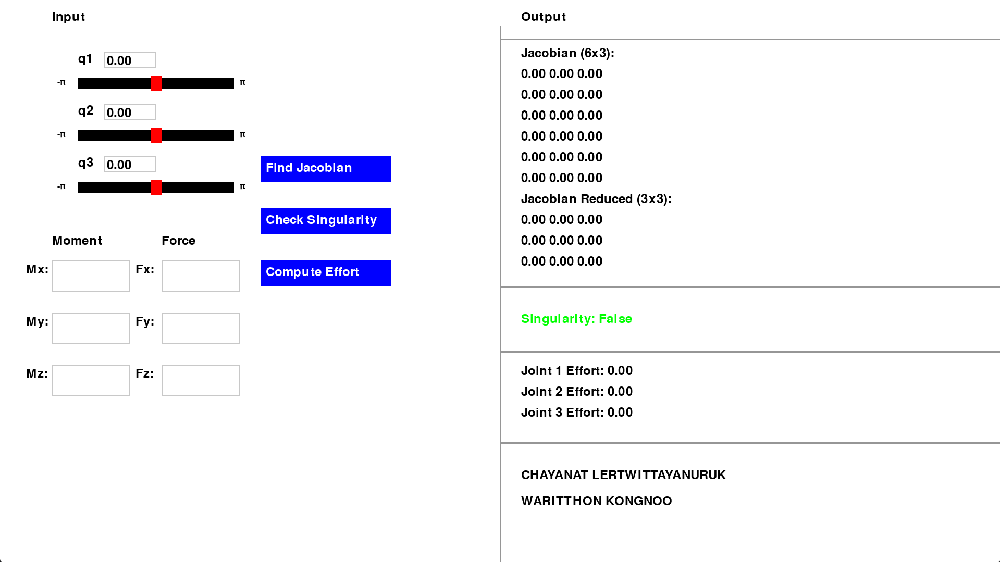
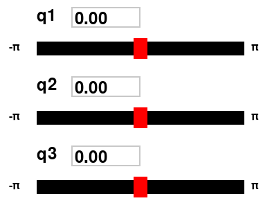
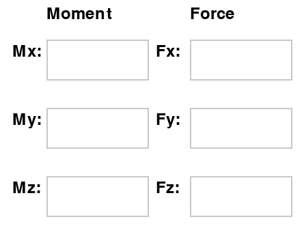
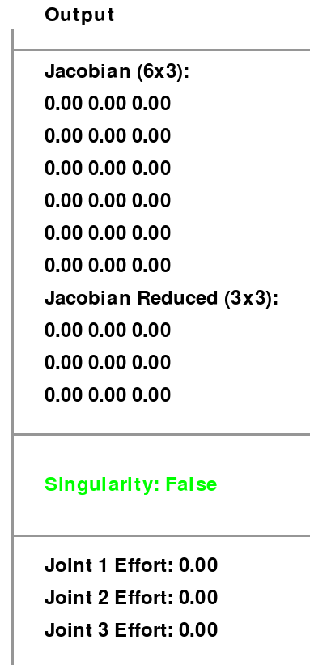
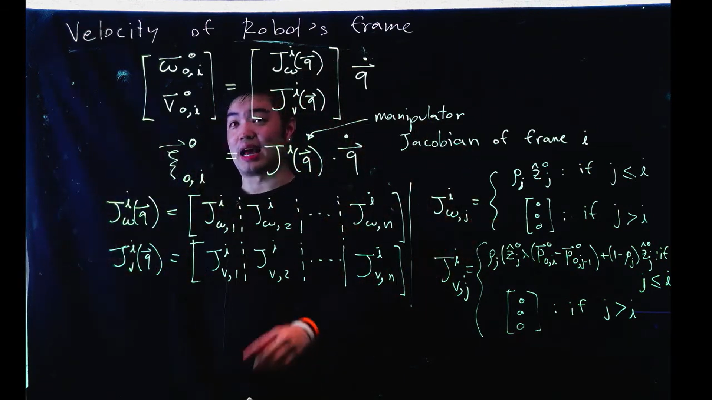

# FRA333_HW3_6512_6550

จากโจทย์เป็นการสร้างโปรแกรมสำหรับใช้ในการหาค่า

-  EndEffector Jacobian
-  การเกิด Singularity
-  Effort ของแต่ละ Joint

ภายใต้ Joint Configuration และ Wrench ที่มากระทำกับจุดกึ่งกลางของเฟรม $F_e$ ที่สามารถกำหนดได้

**โดยแขนกลมีลักษณะดังนี้**


# Function Detail
ในโปรแกรมได้แบ่งการทำงานออกเป็น 3 function โดยแต่ละ function มีจุดประสงค์การใช้งานที่แตกต่างกัน

- endEffectorJacobianHW3 : function สำหรับการหา Jacobian ของแขนกลภายใต้ Joint Configuration ที่กำหนด
- checkSingularityHW3 : function สำหรับการเช็คว่าจาก Joint Configuration ที่กำหนดเกิด Singularity ขึ้นหรือไม่
- computeEffortHW3 : function สำหรับการหา Effort ของแต่ละ Joint ของแขนกลภายใต้ Joint Configuration และ Wrench ที่มากระทำกับจุดกึ่งกลางของเฟรม $F_e$ ที่กำหนด

## endEffectorJacobianHW3

ในการหา EndEffector Jacobian นั้นมีการกำหนด
- Input : q[3] ซึ่งเป็น array ของ Joint Configuration ที่กำหนด
- Output : $J^{6x6}$ ซี่งเป็น EndEffector Jacobian

โดยในการหา EndEffector Jacobian นั้นมาจากสมการ \
*Joint ทำการหมทุนรอบแกน z

```math
J_e(q)_{6\times3} = 
    \begin{bmatrix}
        Jv_e(q)_{3\times3} \\
        Jw_e(q)_{3\times3}
    \end{bmatrix}
```

โดย

```math
Jv_e(q)_{3\times3} = 
    \begin{bmatrix}

        R^0_1
        \begin{bmatrix}
            0 \\
            0 \\
            1
        \end{bmatrix}
        \times
        (P^0_e - P^0_1) &

        R^0_2
            \begin{bmatrix}
            0 \\
            0 \\
            1
        \end{bmatrix}
        \times
        (P^0_e - P^0_2) &

        R^0_3
        \begin{bmatrix}
            0 \\
            0 \\
            1
        \end{bmatrix}
        \times
        (P^0_e - P^0_3)

    \end{bmatrix}
```

และ

```math
Jw_e(q)_{3\times3} = 
    \begin{bmatrix}

        R^0_1
        \begin{bmatrix}
            0 \\
            0 \\
            1
        \end{bmatrix} &

        R^0_2
        \begin{bmatrix}
            0 \\
            0 \\
            1
        \end{bmatrix} &

        R^0_3
        \begin{bmatrix}
            0 \\
            0 \\
            1
        \end{bmatrix}

    \end{bmatrix}
```

**เนื่องจากแขนกลมีแค่ 3 DoF ทำให้สามารถควบคุมได้แค่ linear velocity เท่านั้นทำให้สามารถลดรูปของ  Jacobian ได้เป็น**

```math
J_{reduce}(q)_{3\times3} = Jv(q)_{3\times3}
```


## checkSingularityHW3

ในการเช็คว่าจาก Joint Configuration ที่กำหนดเกิด Singularity ขึ้นหรือไม่นั้นมีการกำหนด
- Input : q[3] ซึ่งเป็น array ของ Joint Configuration ที่กำหนด
- Output : flang 
  - เป็น True เมื่ออยู่ใกล้สภาวะ Singularity 
  - เป็น False เมื่ออยู่ในสภาวะปกติ

โดยในเช็คว่าเกิด Singularity ไหมนั้นมีการใช้ค่า Manipulability(m) ของแขนกลในการนำมาเปรียบเทียบกับค่า $\varepsilon$ ที่กำหนด

โดย
```math
\varepsilon = 0.0001
```

และ
```math
m = \det(J_{reduce})
```

ซึ่งแขนกลจะอยู่ใกล้สภาวะ Singularity ก็ต่อเมื่อ

```math
m < \varepsilon
```


## computeEffortHW3

ในการหา Effort ของแต่ละ Joint นั้นมีการกำหนด
- Input : q[3] ซึ่งเป็น array ของ Joint Configuration ที่กำหนด
- Input : w[6] ซึ่งเป็น array ของ Wrench ที่มากระทำกับจุดกึ่งกลางของเฟรม $F_e$ ที่กำหนด
- Output : $\tau^{3x1}$ ซี่งเป็น Effort ของแต่ละ Joint

โดย Wrench คือ

```math
W_{6\times1} = 
    \begin{bmatrix}
        moment(n^e)_{3\times1} \\
        force(f^e)_{3\times1} \\
    \end{bmatrix}
```

**เนื่องจากแขนกลมีแค่ 3 DoF ทำให้สามารถควบคุมได้แค่ force เท่านั้นทำให้สามารถลดรูปของ wrench ได้เป็น**

```math
W_{3\times1} = force(f^e)_{3\times1}
```

โดยในการหา Effort ของแต่ละ Joint นั้นมาจากสมการ
```math
\tau_{3x1} = J_{reduce}^T(q)W
```

# How to use

ทำ download github นี้ brand main 

```
git clone https://github.com/DenWaritthon/FRA333_HW3_6512_6550.git
```

## Use testScript.py

ทำการ Run file ชื่อ

```
testScript.py
```

หลังจาก run เสร็จจะพบกับผลการคำนวณตาม function ทั้งหมดบน terminall 

## Use UI_testScript.py

ทำการ Run file ชื่อ

```
UI_testScript.py
```

เมื่อทำการ run จะมีหน้าต่าง UI สำหรับทดสอบการทำงานของ function ปรากฏขึ้น



การใช้งานหน้าต่าง UI 

- สามารถกำหนดค่า Joint Configuration ได้โดยการกรอกค่าลงใน text box และใช้ slide bar ในการเลือกค่าที่ต้องการ โดยค่าจะอยู่ในช่วง $[-\pi , \pi]$


  
- สามารถกำหนดค่า Wrench ที่มากระทำกับจุดกึ่งกลางของเฟรม $F_e$ ได้โดยการกรอกค่าลงใน text box



- เรียกใช้งาน function โดยเลือกจาก button
  - Find Jacobian สำหรับเรียกใช้ function : endEffectorJacobianHW3
  - Check Singularity สำหรับเรียกใช้ function : checkSingularityHW3
  - Compute Effort สำหรับเรียกใช้ function : computeEffortHW3
  


**เมื่อทำการเรียกใช้งาน function จะแสดงผลในหน้าจอฝั่ง Output**



- สามารถปิดหน้าต่าง UI ได้โดยการกดปุ่ม **'q'** บน keyboard

# Demo

## Demo testScript.py


<video controls src="https://github.com/DenWaritthon/FRA333_HW3_6512_6550/blob/main/picture/VDO_testScript.mp4" title="VDO_testScript"></video>

## Demo UI_testScript.py

<video controls src="picture/VDO_UI_testScript.mp4" title="VDO_UI_testScript"></video>

# Referent

- [The Ultimate Guide to Jacobian Matrices for Robotics](https://automaticaddison.com/the-ultimate-guide-to-jacobian-matrices-for-robotics/)
- [พื้นฐานวิทยาการหุ่นยนต์ : เมตริกซ์จาโคเบียนของแขนกล](https://www.youtube.com/watch?v=exG5zOAm7pA&list=PLHnZZE5j6C65J4-1t-azzmceXevAtWbRf&index=11)



*ภาพประกอบการอธิบายสมการ Jacobian of frame i


Chayanat Lertwittayanuruk\
Waritthon Kongnoo
